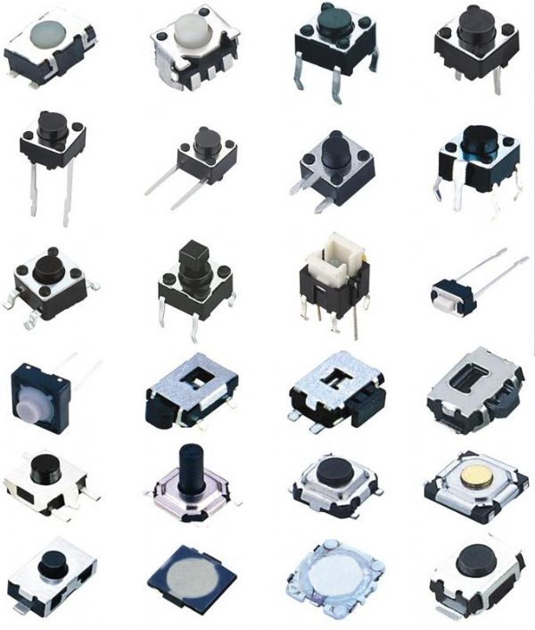

### 单个机械按键驱动模块
---



----
**简介**

> 单个机械按键的操作，通常分为两种模式，即长按和短按。其中，长按又可分为定时长按与计时长按，定时长按即按下按键并保持按下状态达到设定时间后触发事件，且只触发一次，常用于设备复位。而计时长按则为在保持按下状态的情况下，达到设定时间（长度）值便触发一次事件，直到松开按键为止，此种方式常用于长按自动累加调整数值。短按则又可以分为单次点击和连续多次点击两种，单次点击就是按一下按键然后就松开，常用于普通的按键控制等；多次点击就是在设定的时间内连续按下、松开、再按下、再松开，来回多次，常用于一些设备的快速控制，如静电放电枪的扳机（开关），在停止状态下，扣动一次，则会切换电压极性，在停止状态下，连续扣动2次则会增加实验电压值，连续扣动3次则会减少实验电压值，连续扣动4次则会开始实验。

#### 模块

KEYBOARD *（\_btnKey, \_tmBtn, \_btnDef = 1, even_djlong = None, even_lj = None, \_pull = None）*

###### 参数说明
------
**\_btnKey**
> 按钮引脚，按键所对应的IO引脚

**\_tmBtn**
> 定时器，用于定时扫描按键对应的IO状态。

 **\_btnDef**
> 按键初始状态，若为1，则为高电平，低电平闭合。

  * 取值范围：`0` 或 `1`
  * 默认值：`1`


**even_djlong**
> 长按事件，若为None则为不启用，否则将调用指定的函数。

* 取值范围：`None` 或 `其它`
* 默认值：`None`（即不启用）

**even_lj**
> 连续点击事件，若为None则为不启用，否则将调用指定的函数。

* 取值范围：`None` 或 `其它`
* 默认值：`None`（即不启用）

**\_pull**
> 触发方式，按键弹起后触发或按下后触发。

* 取值范围：`UP`、`DOWN`、`None`
* 默认值：`UP`


###### 事件说明
------
**evn_long(con)**
> * 按键长按事件，若不带参数，则表示触发了一次固定时长的长按事件，若带参数，则会返回当前按下并保持按钮状态的时长；
> * con为返回的连续有效的计时次数，时间间隔与定时器的设置有关。统计时间时可以使用 （con×时间间隔）÷1000；
> * 事件名称可在引用时自定义；
> * 长按计时与长按事件不可同时触发，两者二选一。


**evn_con(con)**
> * 按键连续点击事件，在规定的时间间隔内连续按下并松开按键的次数；
> * con 为事件返回的按键点击次数，若为`1`则表示为单击。


#### 用法举例：

```python
from keyboard import KEYBOARD

# 按键引脚
p = Pin('B3')

# 定时器,按键时钟使用
s = Timer(1)

# 长按事件
def evn_long(con):
    print("您按下按键已保持 ", (con*10)/1000," 秒的时间了")

# 连续点击事件
def evn_con(con):
    print("您已连续点击了：", con, " 次")
    
# 声明按键对象，并设置事件
sw = KEYBOARD(p, s, 0, evn_long, evn_con, "UP")


```
