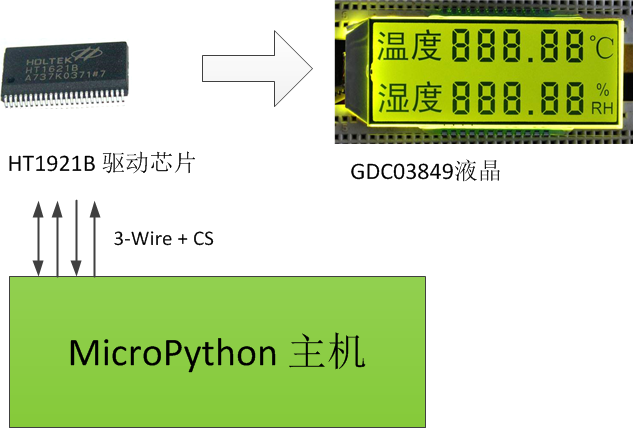

[English](./README.md)

3Wire-HT1621B-GDC03849
====



HT1621B
----
HT1621B 一款LCD驱动芯片。其具有4个COM口和32个SEGO端。

参数：

name | Op
---- | ----
Val  | 20


**API**

* init(_timer = CMD_TIMER_DIS,      # 时期输出设置</BR>
         _wdt   = CMD_WDT_DIS,        # WDT溢出标志输出设置</BR>
         _scs   = CMD_RC256K,         # 系统时钟源设置</BR>
         _bias  = CMD_B3C4,           # 偏压和公共端设置</BR>
         _tone  = CMD_TONE4K,         # 声音设置</BR>
         _irq   = CMD_IRQ_DIS,        # IRQ设置（生效/失效）</BR>
         _twc   = CMD_F128,           # 时期/WDT时钟输出设置（F1～F128）</BR>
         _mod   = CMD_NORMAL          # 模式设置（测试模式和普通模式）</BR>
         )</BR>
芯片功能与参数初始化。

* HT1621xWrCmd(_cmd)</BR>
发送单个命令。</BR>
_cmd: 命令。（16进制）

* HT1621xWrOneData(_addr, _htdata)</BR>
指定地址发送单个数据。</BR>
_addr: 地址（16进制）</BR>
_htdata:数据，通常为1个字节。（16进制）

* HT1621xWrAllData(_addr, _htdata)</BR>
指定起始地址，连续发送多个数据。</BR>
_addr：起始地址（16进制）</BR>
_htdata：连续的数据（16进制列表）

* ALLSHOW(_addr, _nbit)</BR>
指定起始地址连续发送指定个数的 1。</BR>
_addr:起始地址（16进制）</BR>
_nbit:数据SEG位数。
  

* ALLCLEAR(_addr, _nbit)</BR>
指定起始地址连续发送指定个数的 0。</BR>
  _addr: 起始地址。（0x00-0x)</BR>
  _nbit: RAM区（SEG）个数（1-32）。</BR>
  
* LCDON()</BR>
打开LCD偏压发生器。
  
* LCDOFF()</BR>
关闭LCD偏压发生器。  

* HTBEEP(_t)</BR>
使蜂鸣器一直响指定的时间后不响。</BR>
  _t:保持时间，单位：毫秒
  ```python
  # 响500毫秒
  HTBEEP(500)
  ```
  
  </BR></BR>


GDC03849
----
GDC03849 is a LCD


API

USER
